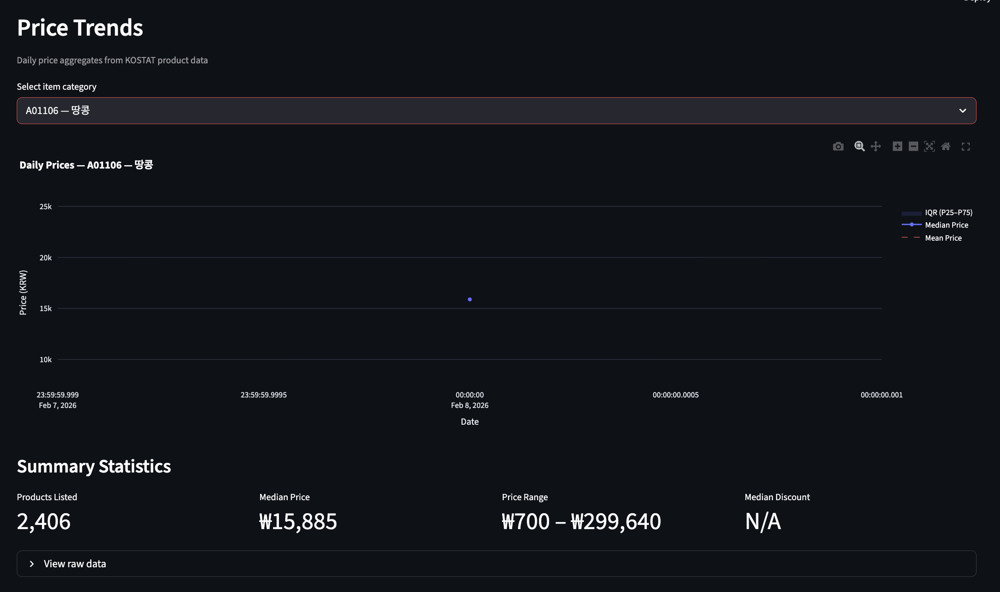
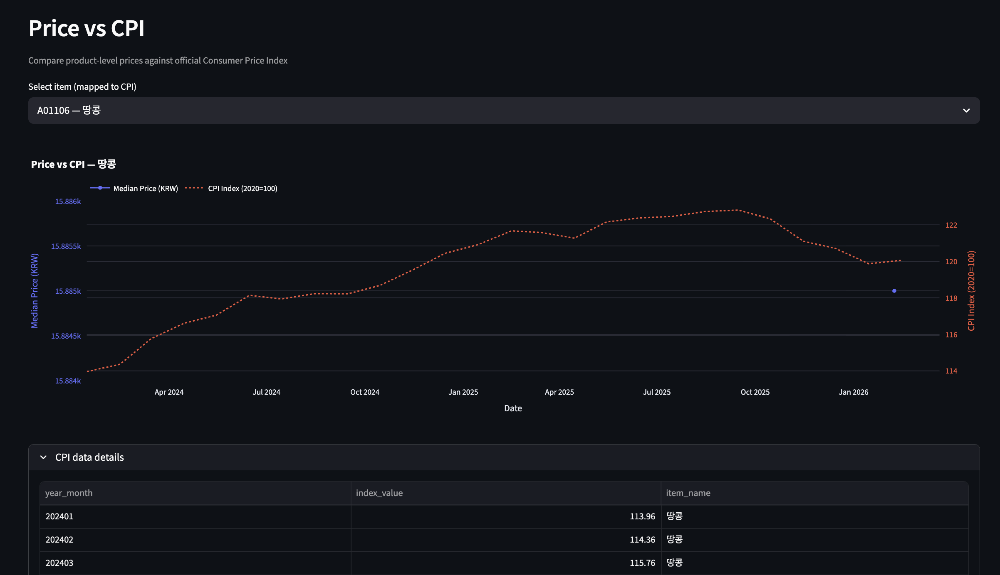
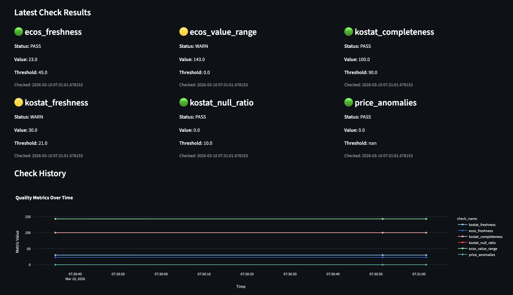
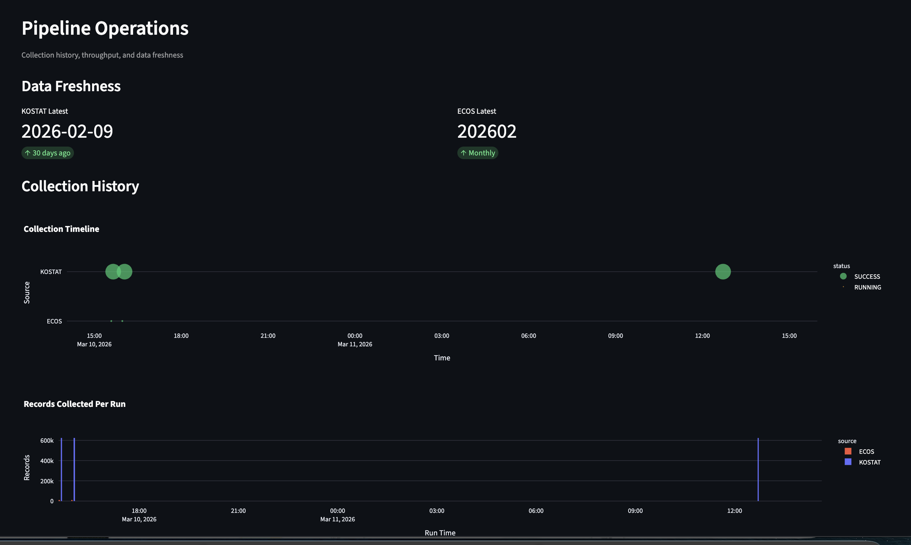

# Real-Time Price Monitoring Pipeline

A data engineering pipeline that collects Korean consumer price data from two government sources, validates data quality, and produces analytical summaries comparing product-level prices against official CPI indices.

## Problem

Korean consumer prices are published by multiple government agencies in different formats, at different frequencies, and with different granularities. Statistics Korea (KOSTAT) publishes product-level e-commerce prices weekly in XML. The Bank of Korea (ECOS) publishes CPI indices monthly in JSON. There's no single place to compare "what are consumers actually paying?" against "what does the official inflation index say?" - and no automated way to detect when these data sources drift, fail, or return stale data.

## Approach

Build a pipeline that treats data quality as a first-class concern, not an afterthought. The system collects from both sources on independent schedules, stores all raw data (no lossy aggregation on ingest), validates every collection run against 6 quality checks, detects schema drift from upstream APIs, and produces both aggregated summaries and an interactive dashboard. Every threshold is calibrated against observed data, not textbook defaults, and every architectural choice is documented with rationale in `01-DECISIONS.md`.

## Architecture

```
  KOSTAT API (product prices)     ECOS API (CPI indices)
        │                                │
        ▼                                ▼
  ┌──────────────────────────────────────────┐
  │         Schema Drift Detection           │
  │      (baseline comparison per run)       │
  └──────────────────────────────────────────┘
        │                                │
        ▼                                ▼
  collect_kostat.py              collect_ecos.py
  (XML, adaptive date probe)     (JSON, pagination)
        │                                │
        ▼                                ▼
  ┌──────────────────────────────────────────┐
  │             PostgreSQL (Docker)           │
  │  raw.kostat_products  │  raw.ecos_indices │
  │  (partitioned monthly)│  (dedup index)    │
  └──────────────────────────────────────────┘
        │                                │
        ▼                                ▼
  ┌──────────────────────────────────────────┐
  │          Quality Validation              │
  │  freshness · completeness · null ratio   │
  │  anomaly detection (IQR) · CPI range     │
  └──────────────────────────────────────────┘
        │
        ▼
  ┌──────────────────────────────────────────┐
  │            Aggregation (SQL)              │
  │  mart.daily_price_summary (median/IQR)   │
  │  mart.monthly_cpi_index (latest-wins)    │
  │  mart.price_vs_cpi (joined view)         │
  └──────────────────────────────────────────┘
        │
        ▼
      Alerts (optional)
```

## Data Sources

**KOSTAT Online Price Collection** (통계청 온라인 수집 가격 정보) — Product-level prices scraped from e-commerce sites by Statistics Korea. 124 active item categories, ~600K products per collection. Weekly updates with ~2 week lag. XML-only API.

**ECOS** (한국은행 경제통계시스템) — Bank of Korea CPI indices. 1,743 hierarchical items, base year 2020=100. Monthly updates. JSON API.

The two sources share the same CPI classification codes, enabling direct comparison of product-level prices against official macro indices.

## Quick Start

```bash
# 1. Clone and set up
cd 01-price-monitor-pipeline
python -m venv venv && source venv/bin/activate
pip install -r requirements.txt

# 2. Configure
cp .env.example .env
# Edit .env with your API keys (ECOS_API_KEY, DATA_GO_KR_KEY)

# 3. Start PostgreSQL
docker compose up -d

# 4. Run the migration (quality tables)
docker exec -i price-monitor-db psql -U pipeline -d price_monitor < db/migration_002_quality.sql

# 5. Load environment and run
source .env
cd src
python main.py collect-kostat    # ~10 min, collects ~600K product prices
python main.py collect-ecos --start 202501 --end 202602
python main.py aggregate
python main.py validate -v       # data quality checks
python main.py schema-check -v   # schema drift detection
```

## CLI Commands

| Command                                    | Description                                                  |
| ------------------------------------------ | ------------------------------------------------------------ |
| `collect-kostat`                           | Collect KOSTAT product prices (auto-detects latest date)     |
| `collect-kostat --date 20260208`           | Collect specific date                                        |
| `collect-ecos`                             | Collect current month CPI                                    |
| `collect-ecos --start 202501 --end 202602` | Collect date range                                           |
| `aggregate`                                | Run raw → mart aggregation                                   |
| `validate`                                 | Run all data quality checks                                  |
| `schema-check`                             | Run schema drift detection                                   |
| `run-all`                                  | Full pipeline: schema check → collect → validate → aggregate |
| `dashboard`                                | Launch Streamlit dashboard                                   |
| `status`                                   | Show recent collection logs                                  |

All commands support `-v` for verbose/debug output.

## Project Structure

```
01-price-monitor-pipeline/
├── src/
│   ├── main.py                    # CLI entrypoint
│   ├── dashboard.py               # Streamlit dashboard (4 pages)
│   └── pipeline/
│       ├── config.py              # All settings (API keys, thresholds)
│       ├── db.py                  # DB connection + CollectionLog
│       ├── collect_kostat.py      # KOSTAT collector (XML, adaptive probing)
│       ├── collect_ecos.py        # ECOS collector (JSON, pagination)
│       ├── aggregate.py           # SQL-based aggregation (raw → mart)
│       ├── quality.py             # Data quality validation (6 checks)
│       ├── schema_check.py        # Schema drift detection
│       └── alerts.py              # Slack webhook alerting
├── db/
│   ├── init.sql                   # Full DDL (auto-runs on docker compose up)
│   └── migration_002_quality.sql  # Quality tables migration
├── tests/
│   └── test_pipeline.py           # 23 unit + integration tests
├── scripts/
│   └── cron_collect.sh            # Cron wrapper (env loading, logging)
├── docker-compose.yml
├── requirements.txt
├── .env.example
├── item_mapping.csv               # KOSTAT ↔ ECOS code mapping (124 items)
├── item_mapping_insert.sql        # Seed data for mart.item_mapping
├── 01-CONTEXT.md                  # Project context and goals
├── 01-ROADMAP.md                  # Phase-by-phase task tracking
├── 01-DECISIONS.md                # Architecture Decision Records (8 ADRs)
├── 01-JOURNAL.md                  # Honest progress journal
└── 01-SCHEMA-DESIGN.md            # Database schema documentation
```

## Data Quality Checks

| Check             | Threshold                | Rationale                                                      |
| ----------------- | ------------------------ | -------------------------------------------------------------- |
| KOSTAT freshness  | > 21 days → WARN         | Weekly updates + 2 week lag; 21 days = 1 missed cycle          |
| ECOS freshness    | > 45 days → WARN         | Monthly updates; 45 days = 1 missed cycle                      |
| Item completeness | < 90% → WARN             | Some items missing per date is normal; < 90% is systematic     |
| Null sale_price   | > 10% → WARN             | Products should always have prices; high nulls = parsing issue |
| ECOS CPI range    | Outside [30, 250] → WARN | Sub-indices legitimately range widely                          |
| Price anomalies   | Change > 2× IQR → WARN   | IQR-based detection, robust to non-normal distributions        |

## Key Technical Decisions

Documented in `01-DECISIONS.md` with full rationale:

1. **KOSTAT + ECOS** over KAMIS (access restriction) — ADR-001
2. **PostgreSQL via Docker** over DuckDB/SQLite — ADR-002
3. **Store all raw, aggregate later** — ADR-003
4. **Cron + Python** over Airflow — ADR-004
5. **Pre-build API verification** — ADR-005
6. **Defensive KOSTAT parsing** (undocumented API behaviors) — ADR-006
7. **Quality threshold rationale** (every number justified) — ADR-007
8. **Streamlit over Grafana** (analytical insight over monitoring) — ADR-008

## Dashboard

```bash
cd src && streamlit run dashboard.py
# OR: python main.py dashboard
```

Opens via `localhost`. Use the sidebar on the left to navigate between 4 pages:

**Price Trends** -

Select any of the 124 product categories from the dropdown. The chart shows a time series of the median price (solid blue line) with an IQR band (shaded area between the 25th and 75th percentile prices). A dashed red line shows the mean price. When the median and mean diverge, it signals skewed pricing - a few very expensive or very cheap products pulling the average away from what most consumers actually pay. Below the chart, summary metrics show the latest product count, median price, full price range, and median discount rate.

**Price vs CPI** -

The core "so what?" page. Select a product category that's mapped to a CPI index (124 items have a direct match). The dual-axis chart overlays the actual median product price (left axis, in KRW) against the official CPI index (right axis, base year 2020=100). An insight callout at the bottom calculates: "Product prices changed +X% while CPI changed +Y%." When product prices rise faster than the CPI, it suggests the official index may understate real consumer cost increases for that category - or that e-commerce pricing dynamics differ from the broader market the CPI measures.

**Data Quality Health** -

Shows the latest results from the 6 automated quality checks, each displayed as a color-coded card (green = PASS, yellow = WARN, red = FAIL). A historical line chart tracks how each metric changes over time, useful for spotting gradual degradation (e.g., completeness slowly dropping). Below that, an anomalies table lists any products flagged by the IQR-based price anomaly detector - items where the median price changed by more than 2x the interquartile range between consecutive collection dates.

**Pipeline Ops** -

Operational monitoring. Data freshness indicators show how many days since the last KOSTAT and ECOS collection. A scatter plot timeline shows every collection run (color = success/failure, size = number of records), making it easy to spot failures or runs that returned unusually few records. A bar chart shows records collected per successful run. An expandable log table at the bottom has the full collection history with duration and error messages.

## Scheduling (Cron)

```
0 9 * * 1   cron_collect.sh kostat      # Mondays 9:00 AM
0 9 5 * *   cron_collect.sh ecos        # 5th of month 9:00 AM
30 9 * * 1  cron_collect.sh aggregate   # Mondays 9:30 AM
```

## API Keys

- **ECOS**: Register at [ecos.bok.or.kr](https://ecos.bok.or.kr) → 개발자센터 → 인증키 신청
- **data.go.kr**: Register at [data.go.kr](https://www.data.go.kr) → Search "통계청\_온라인 수집 가격 정보" → 활용신청

## Learnings

Things that surprised me or that I'd do differently:

- **KAMIS was unusable** — the original data source (Korea Agricultural Marketing Info Service) requires company registration. Pivoted to KOSTAT, which turned out to have richer data (individual product listings vs aggregated prices). The pivot improved the project.
- **Government API docs lie** — KOSTAT's API guide showed 7-character item codes; real data uses 6. Successful responses omit the result code entirely (only errors include it). Had to discover the real behavior empirically.
- **Thresholds need data, not theory** — initially set CPI range to [80, 130] based on "CPI ≈ 100." Real sub-indices range from 47 to 211. First quality check flagged 143 false positives. Widened to [30, 250] after analyzing actual distributions.
- **Airflow would have been wrong here** — with 2 sources on weekly/monthly cycles, the orchestration complexity doesn't justify Airflow. Cron + structured logging gives the same observability for this workload.

## Limitations

- **Not truly real-time**: KOSTAT data has ~2 week lag despite the project name. Weekly collection is the best possible cadence.
- **Single-machine deployment**: No HA, no cloud infra. Designed as a portfolio piece, not a production service.
- **No PPI/wholesale data yet**: ECOS has PPI tables (stat codes `404Y014`–`404Y017`) documented for future expansion but not in the current pipeline.
- **Dashboard has no auth**: Streamlit runs locally with no user management.

## Cost Estimate (if deployed to AWS)

See `docs/cost-analysis.md` for the full breakdown. Summary: ~$35–50/month on AWS (t3.small EC2 + db.t3.micro RDS + 20 GB gp3).

## Requirements

- Python 3.10+
- Docker (for PostgreSQL 16)
- ~500 MB disk per month of raw data
